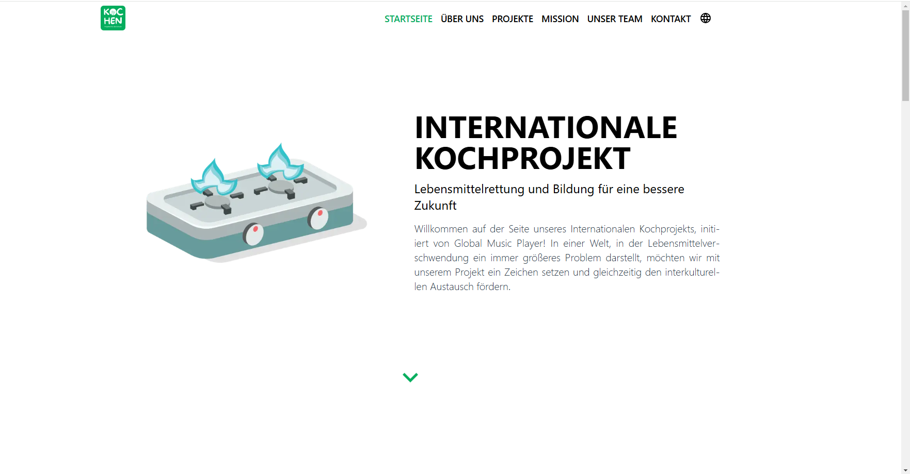

# 🌍 Global Music Player - International Cooking Project

Bienvenue dans le dépôt du projet **Global Music Player - International Cooking Project** ! Ce projet vise à promouvoir l'échange culturel et la durabilité en organisant des cours de cuisine internationale dans les écoles de la région d'Oldenburg. Le projet met en lumière des cuisines du monde entier tout en sensibilisant à la réduction du gaspillage alimentaire. Les fonds collectés grâce au projet permettront de construire des écoles au Cameroun et en Côte d'Ivoire.



## 🌟 Fonctionnalités

- **Page d'accueil** : Présentation du projet et de sa mission.
- **Page d'inscription** : Formulaire d'inscription pour les participants et les volontaires.
- **Page Équipe** : Présentation de l’équipe multiculturelle derrière le projet.
- **Page 404 personnalisée** : Redirection en cas de pages non trouvées avec une explication et un bouton pour retourner à l'accueil.

## 📋 Prérequis

- **Next.js** v15 ou supérieur


## 🚀 Installation

1. Clonez le dépôt :

   ```bash
   git clone https://github.com/makombengas/gmp-kochen.git
   cd cook
